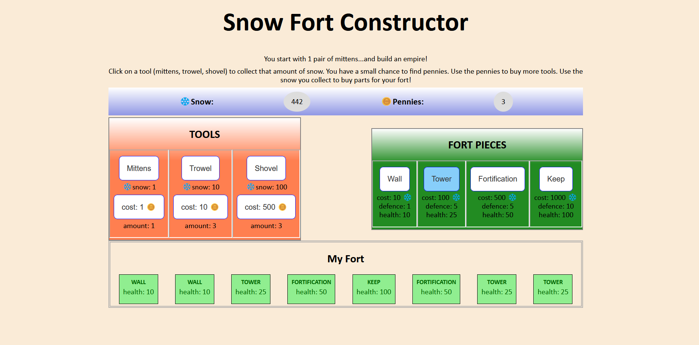
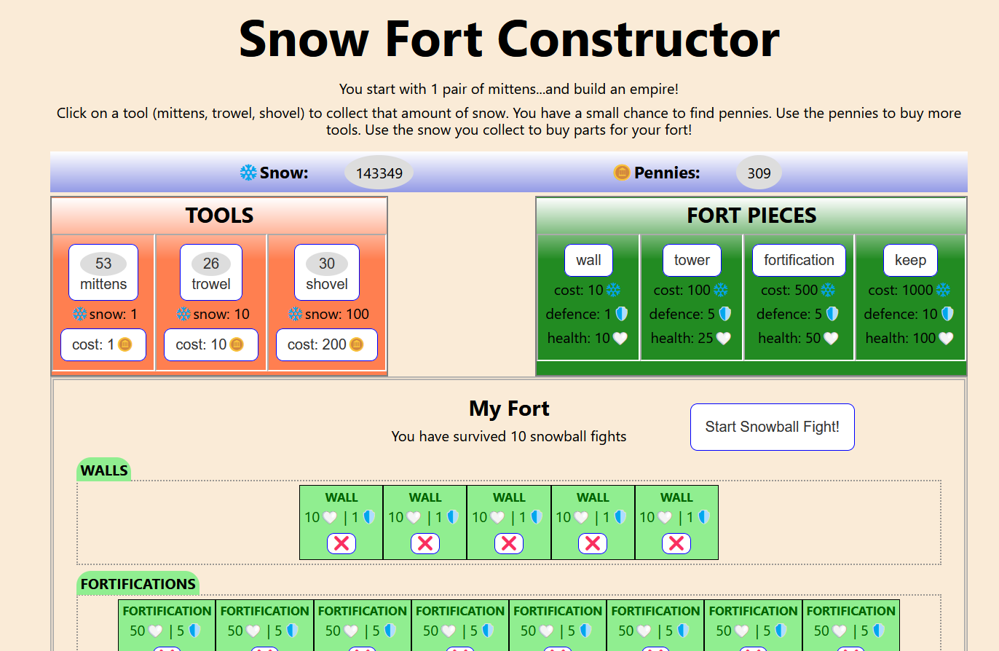
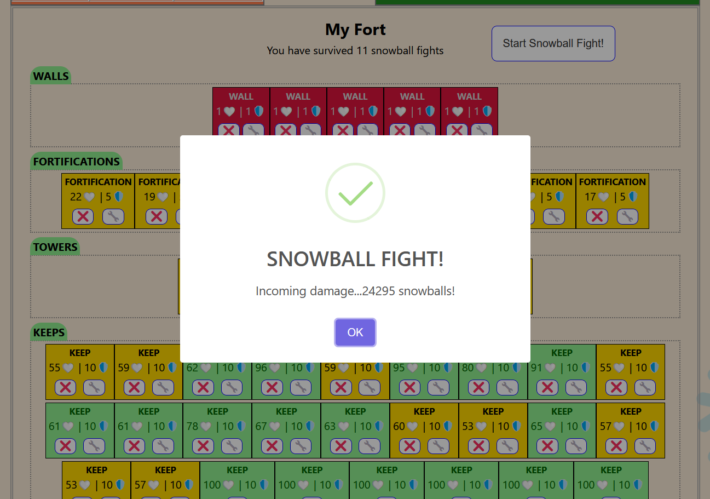

# Snowfort Constructor

A simple idle-clicker where you start with a pair of mittens and no snowfort to speak of. But, as you click on your Tools you gain Snow which you can use to buy pieces of your Fort. Every time you click to gain Snow, you have a small chance to find a Penny. Pennies can be spent to buy more (and better!) Tools. As you buy more Tools, you gain more Snow, and you find Pennies faster.

When you feel ready, you can start a Snowball Fight, which will damage your snowfort. If you survive, you can re-build, repair, gather more Tools and Snow, and keep starting Snowball Fights as you go. The goal is to see how many Snowball Fights you can survive! Just like in a real snowball fight, the goal of your antagonists is to hit *you* with snowballs, so your fort will only block some of the damage, not all.

[Live Site](https://snowfort-constructor.netlify.app/)

> Project developed by [Graydon James](https://graydongames.com/), originally as Project #3 by [Juno College](https://junocollege.com/)

## Table of contents

- [Overview](#overview)
  - [The Goal](#the-goal)
  - [Deliverables](#deliverables)
  - [Screenshots](#screenshots)
  - [Built With](#built-with)
- [Contributors](#contributors)
- [License](#license)

## Overview

### The Goal

My goal was to create a React App that used Firebase as a way to store the state of a user's simple idle-clicker-style game. This game was originally developed in vanilla JavaScript and then refactored into React. The look-and-feel is very simple, colourful, and kinda goofy because the game itself is really quite simple and goofy! But, there is a kernel of an enjoyable can-you-survive game at the core of this app, which I hope to continually develop with more and more complexity as time goes on.

### Deliverables

- Use Firebase to store the state of a game
- A user should be able to use their Tools to gather Snow
- When gathering Snow, there is a chance (per unit Snow) to find Pennies
- Users can accumulate Snow and Pennies which they will use to:
  - Purchase parts to add to their snowfort
  - Purchase more Tools
  - Repair damaged parts of their snowfort
  - (eventually) Buy upgrades to their snowfort parts
  - (eventually) Buy upgrades for their Tools
- Interaction should be smooth and give contextual feedback (i.e. when you click a Tool that you don't own yet, you are told you need to purchase that Tool, and also how to gain Pennies to purchase Tools, in general)
- When a snowball fight occurs, damage ripples through the snowfort toward the "Player", with successive levels of the fort reducing the incoming damage until it is either reduced to zero, or the Player is damaged enough that they are removed from their fort and must restart
- Restarting after being "knocked out" of your snowfort maintains your level of Tools, Snow, and Pennies, it just removes your entire fort

### Screenshots

### Built With

- React.js
- Firebase
- git/Github
- VS Code

### Contributors

<table>
  <tbody>
    <tr>
      <td align="center">
        <a href="https://github.com/graydonj">
          
           <b>Graydon James</b>
        </a>
         <a
          href="https://graydongames.com"
          title="graydongames.com"
          >🖥️</a
        >
        <a
          href="mailto:graydonj2@gmail.com"
          title="email Graydon"
          >✉️</a
        >
      </td>
    </tr>
  </tbody>
</table>
